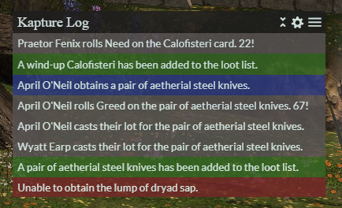

## DEPRECATION NOTICE

ACT Kapture has been officially deprecated and will no longer be supported.
A new version of Kapture has been released as an XIVLauncher plugin with more features and better performance!
Check out the Quick Launcher here: https://github.com/goatcorp/FFXIVQuickLauncher. You can install Kapture through the in-game plugin installer.

<h1 align="center">
   
   kapture log 
</h1>
<h4 align="center">FFXIV ACT Kapture Overlay</h4>

  
  

## Background

kapture log is a loot overlay for use with ACT for FFXIV. This is a simple overlay to track your loot events (new items, obtained, rolls) from the Kapture plugin.

## Preview

## Key Features

* Track your loot events from Kapture plugin.
* Customize row color by event type.
* Support for English, French, German, and Japanese.

## How To Install

* Refer to instructions on the <a href="https://github.com/kalilistic/kapture">Kapture repository</a>.
* Ensure any event types you want to see in the overlay are enabled in the Kapture plugin.
  
  
